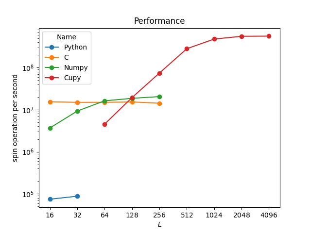
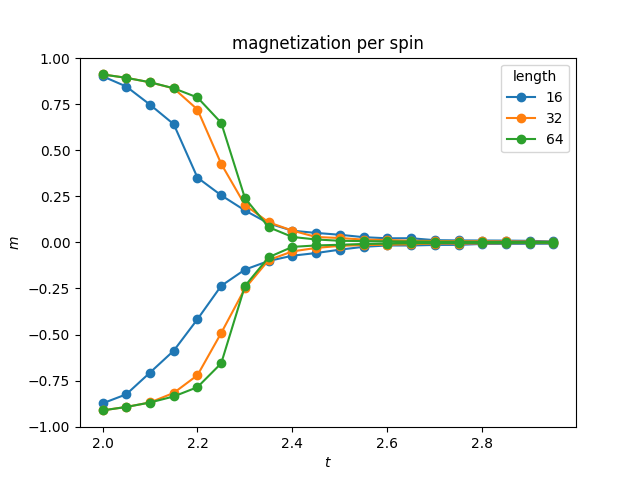
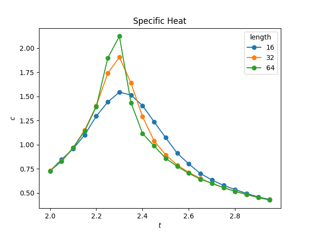
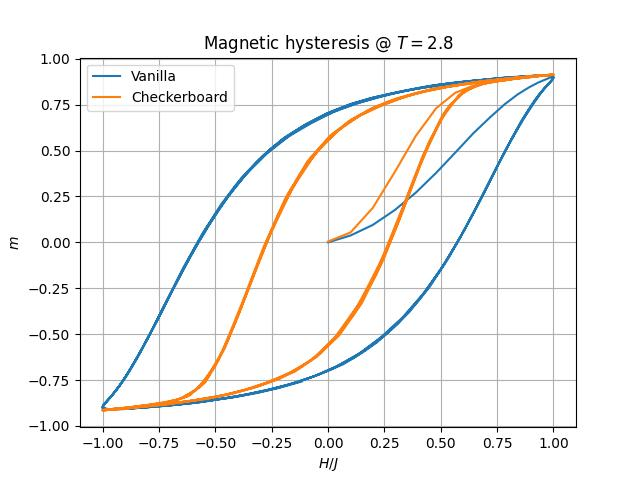

# EasyIsing

This is a Python module that performs the simulation of the Ising model on a square lattice using the Metropolis algorithm. Initially, this tool was made to be used in courses on data analysis or statistical mechanics so that students could generate their own data without having to build a simulator from scratch.

Nevertheless, it contains reasonably clean code with minimal optimizations that can be copied and modified, making it easier for undergraduate students to start their projects.

It is important to note that this module describes the Ising system in terms of a reduced set of variables, which is a common practice.
In other words, $\frac{E}{J}(\{\sigma\}) = -\sum_{(i,j)}\sigma_i \sigma_j - \frac{H}{J} \sum_i \sigma_i$
, where the reduced energy is denoted as $\frac{E}{J}$, the reduced magnetic field as $\frac{H}{J}$, and the reduced temperature $t$ is the inverse of $\beta$, where $\beta = \frac{J}{T k_B}$ and $k_B$ is the Boltzmann constant.

The square lattice is a network of sites, each of which has four immutable connections/interactions with other sites, known as nearest neighbors, indicated by $(i,j)$ under the summation symbol. This is translated into an array of size $L$ by $L$, with periodic boundary conditions, where the elements are integers with values of $\sigma=1$ or $\sigma=-1$, representing a spin-up or a spin-down, respectively.

There is some freedom in the Metropolis algorithm, allowing for the choice of how to change spins in any way that satisfies the detailed balance condition. Typically, one site is chosen randomly because there are no particular reasons to favor one site over another. All sites are equivalent and, due to periodic boundary conditions, are indistinguishable even spatially.

The checkerboard decomposition parallelization approach consists of separating the lattice into two sub-lattices of the same size, like a chessboard. Since the interactions are restricted to first neighbors, there is no interaction between sites of the same sub-lattice. One can update all sites of a sub-lattice at once, which is a common approach to parallelizing Ising-like models.

Both random sequential and checkerboard parallelization should have the same equilibrium properties since both satisfy the detailed balance condition.

This library contains four classes, each with a different implementation:

|Class                   | Name   | Description                  |
| :--- | :---: | :--- |
|EasyIsing.Ising         | Python | Vanilla, traditional random sequential site selection.|
|EasyIsing.IsingC        | C      | Same as above, but in C. The source code will be compiled and saved in the working directory and called through numpy.ctypeslib.|
|EasyIsing.IsingNumpy    | NumPy  | Checkerboard decomposition model parallelization scheme using NumPy array functions.|
|EasyIsing.IsingCupy     | CuPy   | Same as above, but in CuPy to run on the GPU. Note that this class will only be loaded if CuPy is detected.|

With different [performances](examples/Performance.ipynb):

<picture>
    
</picture>


It is assumed that the reader/user is being instruted about Ising model and [Metropolis Algorithm](https://en.wikipedia.org/wiki/Equation_of_State_Calculations_by_Fast_Computing_Machines
). 
So, no futher information will be provided.


### Instalation
```Shell
pip install EasyIsing
```
### Usage

When imported, there are four classes of objects that can be used.
The user just have to create an instance with the desired arguments.
For example:

```Python
import EasyIsing

L = 10
age = 1000
sample = 1000
T = 2.1
H = 0
seed = 84598945

mac = EasyIsing.IsingNumpy(L, seed)
mac.update(age,T,H)
R = mac.sampling(sample,T,H)
print(R)

```
EasyIsing.Ising.sampling return a dict with the data accumulated.

```JSON
{'temperature': 2.1,
 'field': 0,
 'age': 2000,
 'sampleSize': 1000,
 'length': 10,
 'seed': 84598945,
 'energy1': -167.976,
 'magnet1': -88.684,
 'energy2': 28579.168,
 'magnet2': 7945.392,
 'name': 'Numpy'}
```

There is a few examples in directory examples:
* [Specific heat](examples/SpecificHeat.ipynb)
* [Magnetic Hysteresis](examples/MagneticHysteresisLoop.ipynb)
* [performances](examples/Performance.ipynb)

The user can override 'EasyIsing.Ising.sampling' to accumulate other data, or create custom sampling routine. For example, to include the spatial correlation function or 'energy4' and 'magnet4' to calculate Binder's coefficient.

## Suggestions

Here are some suggestions for fun things students can do and analyze using the Ising model simulation:

* Observe the system "walking" to equilibrium with different initial states.
* Analyze the size of error bars for energy, magnetization, etc. as a function of sample size and lattice size.
* Explore specific heat and magnetic susceptibility using the  Fluctuation-Dissipation Theorem and derivatives.
* Calculate the entropy of the system.
* Compare Binder's coefficient with histogram results.
* Analyze critical coefficients.
* Study cluster statistics.
* Analyze the radial distribution function and the Virial expansion.
* Explore magnetic hysteresis using the Magnetic Hysteresis Loop example provided in the EasyIsing module.

<picture>
    
</picture>

<picture>
    
</picture>

<picture>
    
</picture>

## Conclutions

Conclusively, C is an excellent choice for single-threaded performance.
I expect similar performance for FORTRAN, Rust, and C++.
For larger systems, delegating the work to a GPU is by far the better option.
Systems of size $L=128$ are big enough for most projects.
As we can see, for my test machine, for size $L=128$, with the exception of pure Python, the performance of all examples is similar.

Several improvements can be made to increase performance, but they will cost development time and increase the chance of mistakes.

Machine specifications:
Intel® Core™ i7-8700K CPU @ 3.70GHz,
GeForce GTX 1080 Ti,
Ubuntu 22.04.1 LTS,
Python 3.10.4,
gcc version 11.2.0 (Ubuntu 11.2.0-19ubuntu1)

